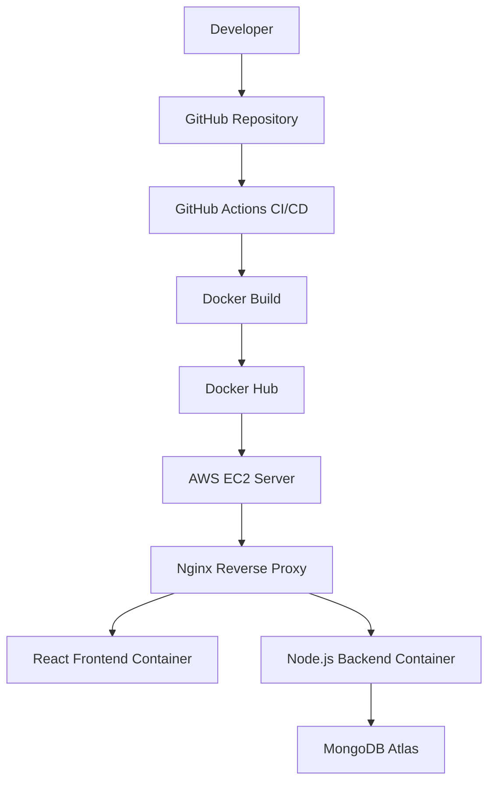
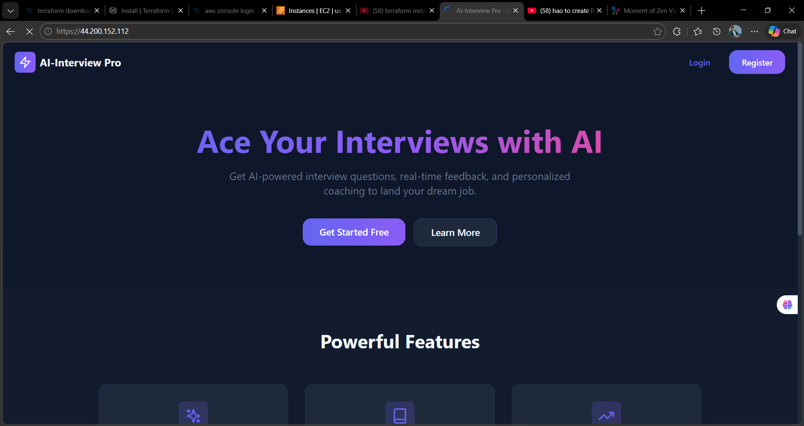
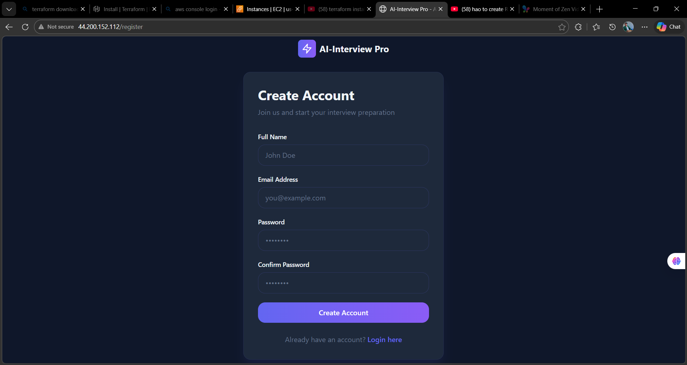
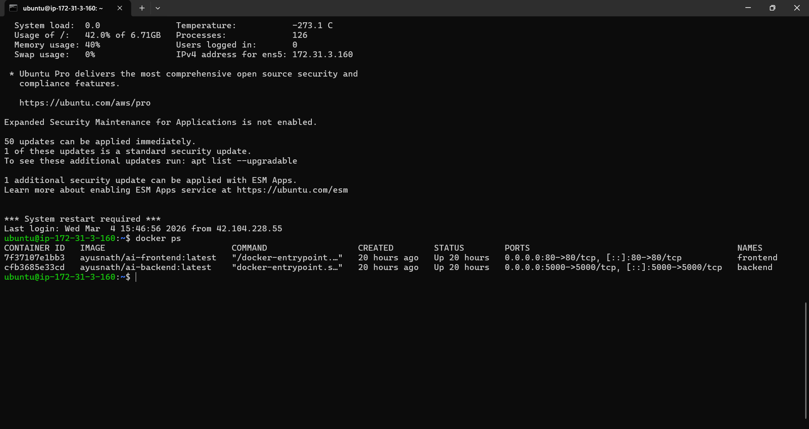
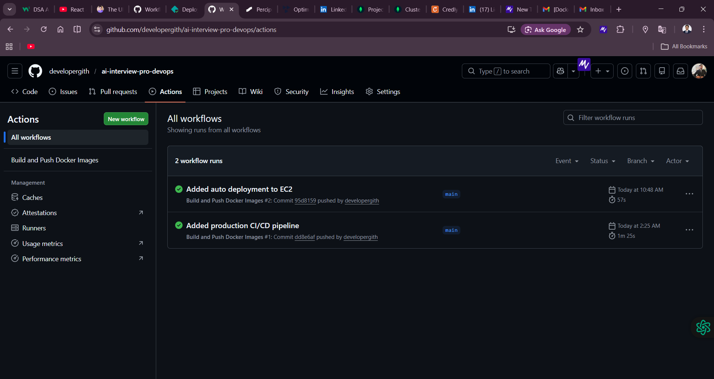
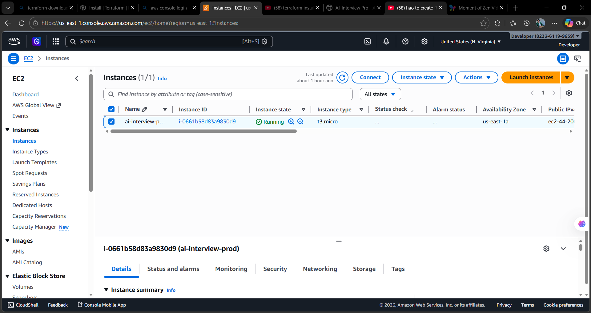
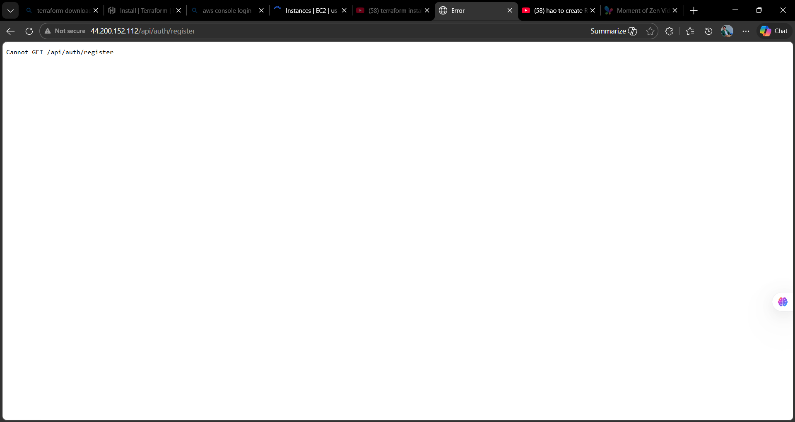

# AI Interview Pro – Full Stack DevOps Project

AI Interview Pro is a full-stack web application that simulates technical interviews using AI-generated questions.

This project demonstrates **production level deployment using Docker, AWS EC2 and CI/CD automation with GitHub Actions**.

---

#  Live Deployment

Application deployed on AWS EC2

Frontend  
http://44.200.152.112

Backend API  
http://44.200.152.112:5000

---

#  Project Overview

This project demonstrates how a real production application is deployed using DevOps practices.

Features
• User authentication  
• AI based interview simulation  
• Secure backend APIs  
• Docker containerized application  
• Automated CI/CD pipeline

---

# 🏗️ Architecture

Developer pushes code to GitHub.  
GitHub Actions builds Docker images and pushes them to Docker Hub.  
EC2 server pulls the latest images and runs containers.




---

#  Tech Stack

Frontend
- React
- Vite
- Tailwind CSS
- Nginx

Backend
- Node.js
- Express.js
- JWT Authentication

Database
- MongoDB Atlas

DevOps
- Docker
- Docker Compose
- GitHub Actions (CI/CD)
- AWS EC2

---

# 🐳 Docker Setup

The application is fully containerized using Docker.

### Build Images

```bash
docker build -t ayusnath/ai-backend ./ai-interview-Backend
docker build -t ayusnath/ai-frontend ./ai-interview-Frontend

---

# Run Containers
docker run -d -p 5000:5000 ayusnath/ai-backend
docker run -d -p 80:80 ayusnath/ai-frontend

---

#AWS Deployment

Application is deployed on AWS EC2 instance.

Steps:

1 Clone repository

git clone https://github.com/developergith/ai-interview-pro-devops.git

2 Pull Docker images

docker pull ayusnath/ai-backend
docker pull ayusnath/ai-frontend

3 Run containers

docker run -d -p 5000:5000 ayusnath/ai-backend
docker run -d -p 80:80 ayusnath/ai-frontend

---

#CI/CD Pipeline

CI/CD pipeline is implemented using GitHub Actions.

Workflow:

1 Developer pushes code to GitHub
2 GitHub Actions builds Docker images
3 Images are pushed to Docker Hub
4 EC2 server pulls latest images
5 Containers restart automatically

---
## Screenshots

### Application UI






### Docker Containers Running



### GitHub Actions Pipeline



### AWS EC2 Instance



## Deployment

