#  AI Interview Pro - End-to-End DevOps Deployment Project

An end-to-end DevOps project demonstrating Infrastructure as Code (Terraform), Configuration Management (Ansible), CI/CD (GitHub Actions), Containerization (Docker), Container Registry (Docker Hub), Kubernetes Orchestration (K3s), Ingress Routing (Traefik), and Cloud Deployment on AWS EC2.

---

#  Project Overview

The goal of this project was to deploy a full-stack MERN application using modern DevOps practices.

Instead of deploying the application manually, the complete infrastructure and deployment process was automated using DevOps tools.

This project demonstrates real-world DevOps workflows including:

- Infrastructure Provisioning
- Configuration Management
- Containerization
- CI/CD Automation
- Kubernetes Deployment
- Ingress Routing
- Cloud Hosting

---

# 🏗 Architecture Diagram

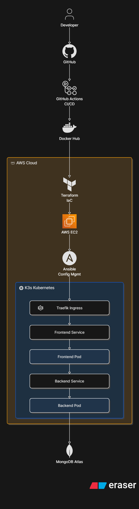

---

#  Complete Workflow

```text
Developer
   ↓
GitHub Repository
   ↓
GitHub Actions CI/CD
   ↓
Docker Hub
   ↓
Terraform
   ↓
AWS EC2
   ↓
Ansible
   ↓
K3s Kubernetes Cluster
   ↓
Traefik Ingress
   ↓
Frontend Pod
   ↓
Backend Pod
   ↓
MongoDB Atlas
```

---

# ⚙️ Tech Stack

## Cloud

- AWS EC2

## Infrastructure as Code

- Terraform

## Configuration Management

- Ansible

## Containerization

- Docker
- Docker Hub

## CI/CD

- GitHub Actions

## Container Orchestration

- K3s Kubernetes

## Networking

- Traefik Ingress Controller

## Application

### Frontend

- React.js
- Vite
- Tailwind CSS

### Backend

- Node.js
- Express.js

### Database

- MongoDB Atlas

---

#  Problem Statement

Deploying applications manually leads to:

- Configuration drift
- Manual errors
- Difficult scaling
- Slow deployments
- Inconsistent environments

To solve this problem, the entire deployment pipeline was automated.

---

#  Step 1: Infrastructure Provisioning with Terraform

Terraform was used to provision AWS infrastructure.

Resources Created:

- EC2 Instance
- Security Group
- SSH Key Pair
- Networking Configuration

### Terraform Commands

```bash
terraform init
terraform plan
terraform apply
```

### Terraform Init

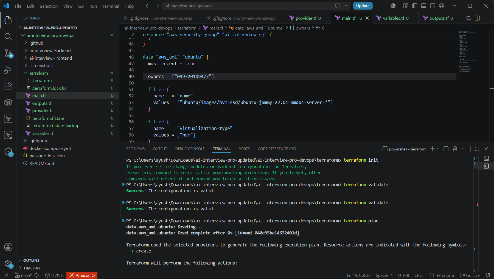

### Terraform Plan

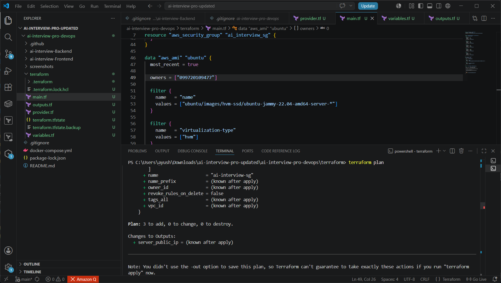

### Terraform Apply

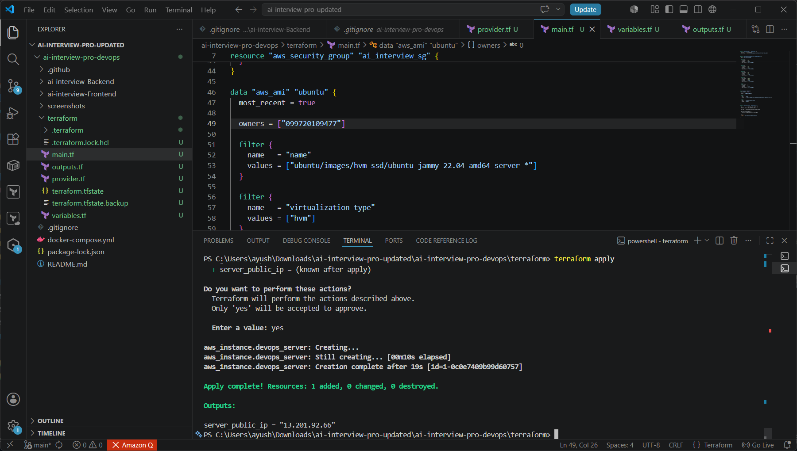

---

#  Step 2: AWS EC2 Deployment

The infrastructure was created successfully on AWS.

### AWS EC2 Running

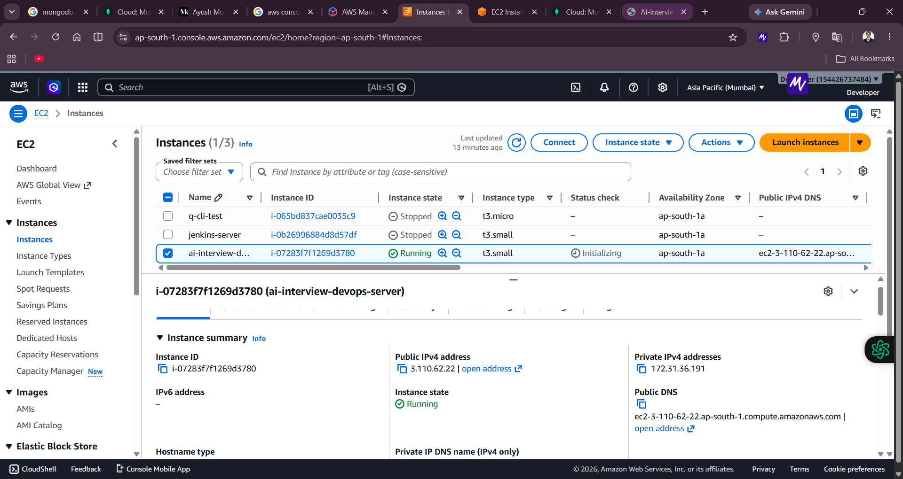

---

#  Step 3: Containerization with Docker

Frontend and Backend applications were containerized using Docker.

Docker images were built and pushed to Docker Hub.

Images:

- ayusnath/ai-frontend
- ayusnath/ai-backend

---

#  Step 4: Docker Hub Registry

Docker Hub was used as a centralized image registry.

### Docker Hub Images

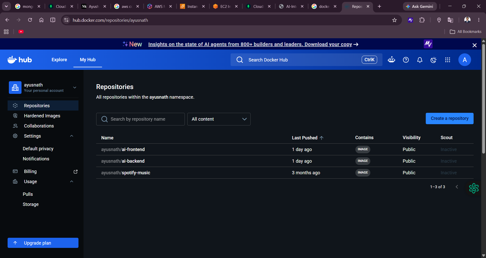

---

#  Step 5: CI/CD using GitHub Actions

A GitHub Actions workflow was created.

Workflow Responsibilities:

- Build Docker Images
- Push Images to Docker Hub
- Automate Deployment Pipeline

Pipeline Trigger:

```yaml
on:
  push:
    branches:
      - main
```

---

#  Step 6: Server Configuration using Ansible

Ansible was used to automate server configuration.

Tasks Automated:

- Docker Verification
- Container Management
- Deployment Automation

### Ansible Success

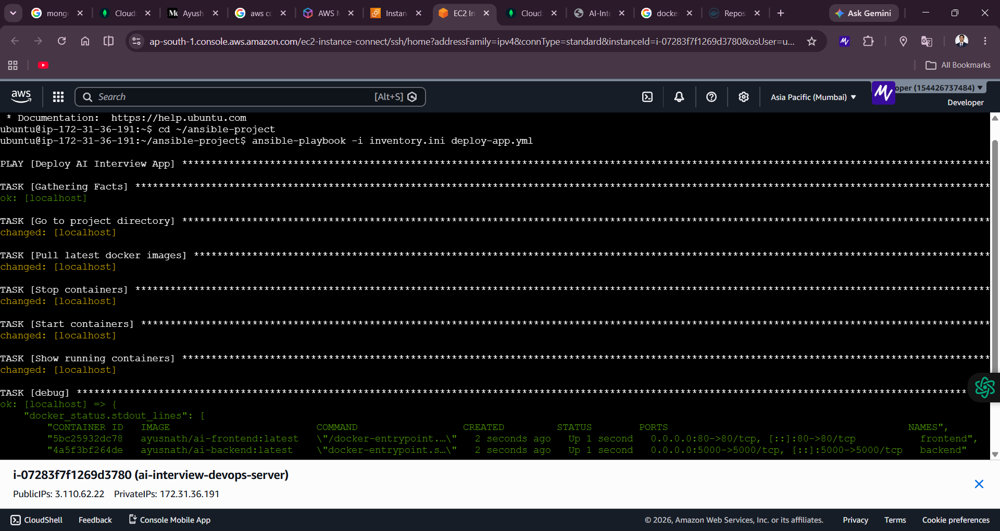

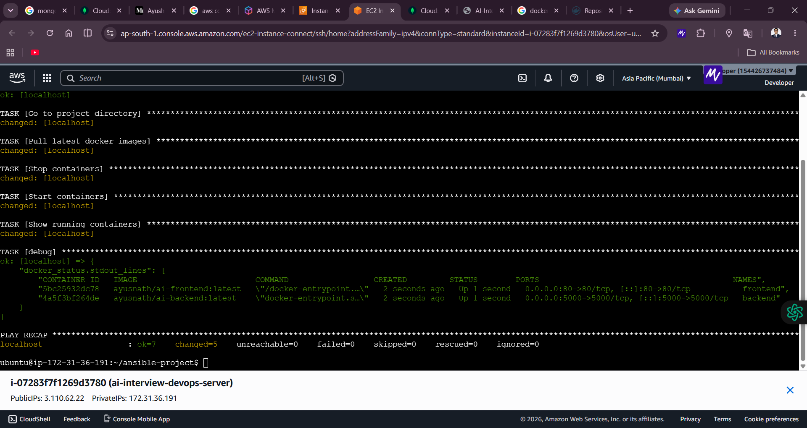

---

#  Step 7: Kubernetes Cluster Setup (K3s)

K3s was installed on AWS EC2.

Why K3s?

- Lightweight
- Low Memory Usage
- Easy Setup
- Perfect for Cloud Learning Projects

---

#  Kubernetes Node Verification

### Kubernetes Node

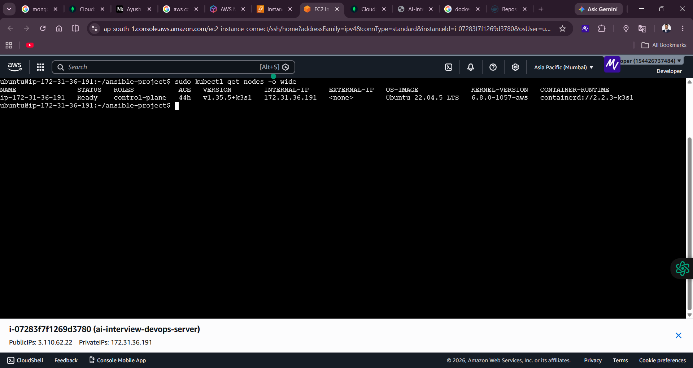

---

#  Kubernetes Pods

Frontend and Backend applications were deployed as Pods.

### Kubernetes Pods

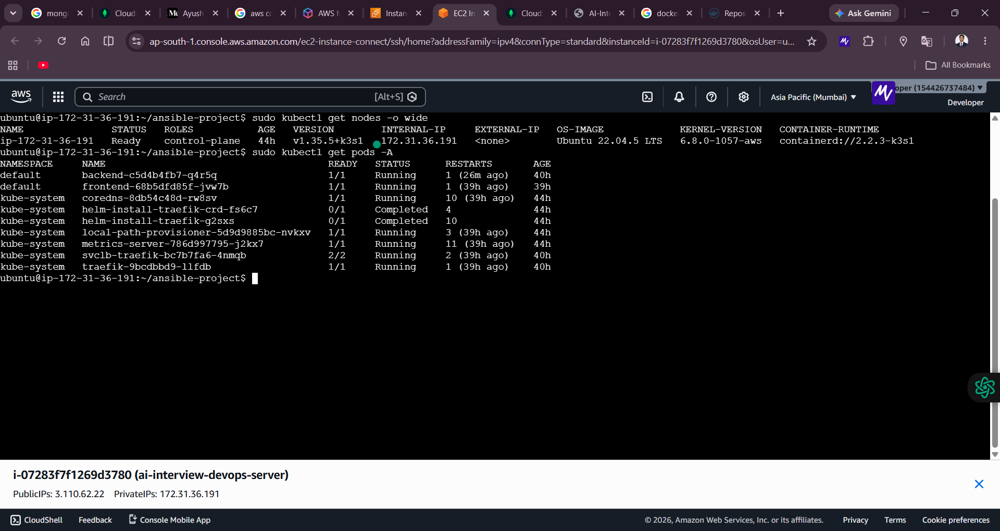

---

#  Kubernetes Services

Services were created for internal communication and external exposure.

### Kubernetes Services

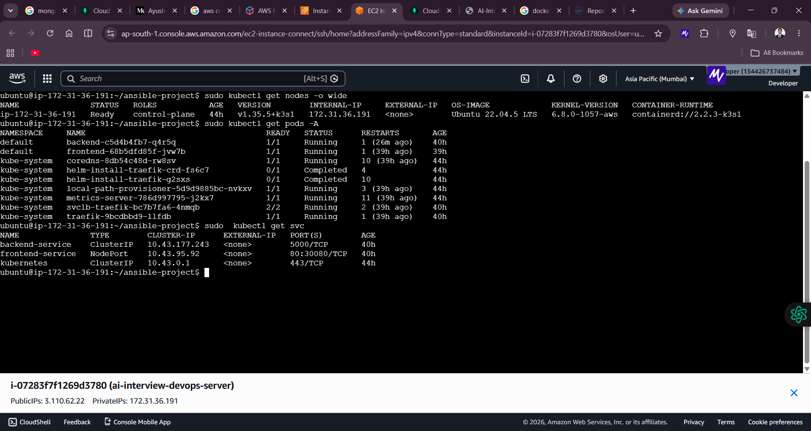

---

#  Traefik Ingress Controller

Traefik was used as the Kubernetes Ingress Controller.

Responsibilities:

- Request Routing
- Load Balancing
- External Access

### Kubernetes Ingress

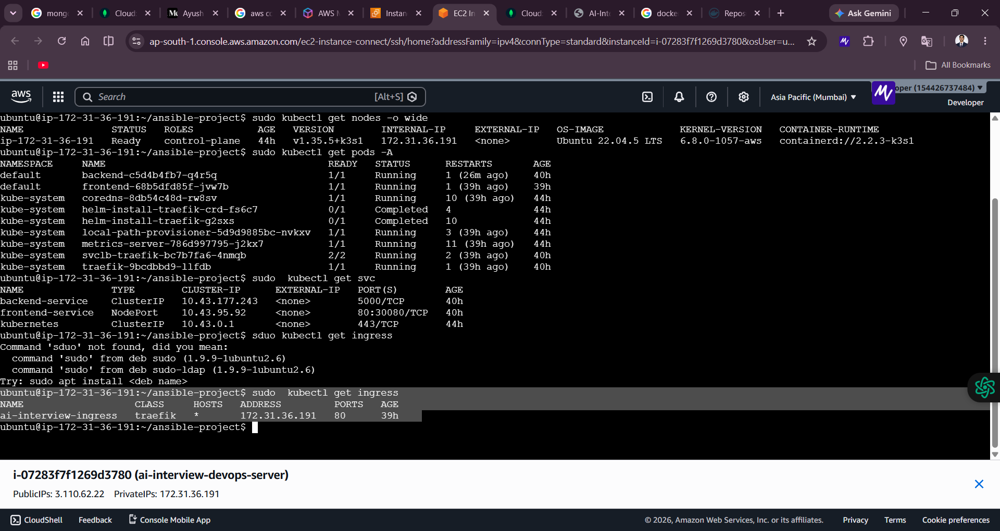

---

#  MongoDB Atlas Integration

MongoDB Atlas was used as a managed cloud database.

Benefits:

- No database management overhead
- High availability
- Secure cloud storage

Application Flow:

```text
Frontend
   ↓
Backend API
   ↓
MongoDB Atlas
```

---

#  Live Application

The application was successfully deployed and accessed through Kubernetes Ingress.

### Live Application

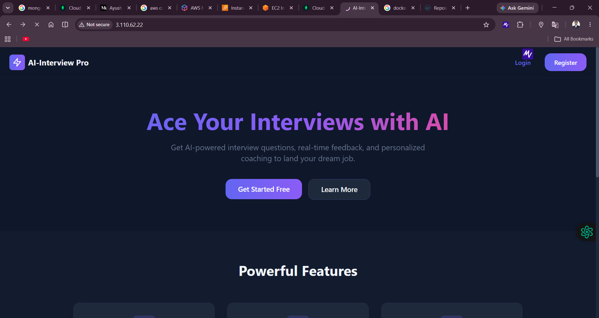

### Github Action
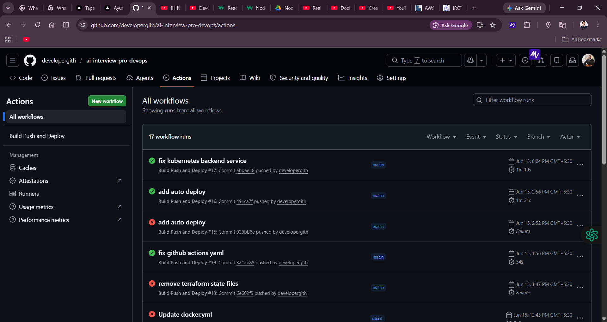

---

#  Project Achievements

Successfully implemented:

* Terraform Infrastructure Provisioning

* AWS EC2 Deployment

* Docker Containerization

* Docker Hub Integration

* GitHub Actions CI/CD

* Ansible Automation

* K3s Kubernetes Cluster

* Traefik Ingress Controller

* MongoDB Atlas Integration

* Full Stack Deployment

---

#  Key Learnings

During this project I learned:

- Infrastructure as Code
- AWS Cloud Deployment
- Docker Containerization
- CI/CD Pipelines
- Kubernetes Concepts
- Ingress Controllers
- Configuration Management
- Production Deployment Workflow

---

#  Future Improvements

- Custom Domain Integration
- HTTPS using Let's Encrypt
- Monitoring with Prometheus
- Grafana Dashboards
- Kubernetes HPA
- Multi-Node Kubernetes Cluster
- ArgoCD GitOps Deployment

---

#  Author

Ayush Nath

GitHub:
https://github.com/developergith

Linkedin:
https://www.linkedin.com/in/ayush-nath-motichoor-7012102b2/

Medium.com
https://medium.com/@ayushmotichoor


---

#  If you found this project useful, give it a star.